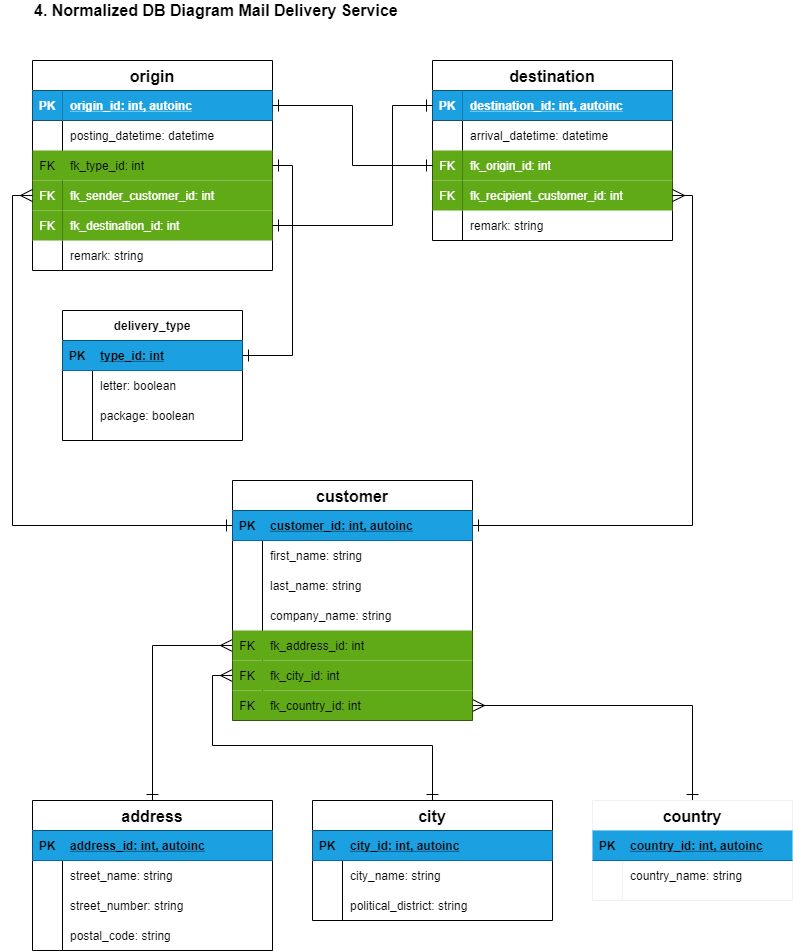

# CFLMS-MarinBalabanov-CodeReview-09

## Mail Delivery Service

A mail delivery service company receives packages/mail from customers at a specific location or picks up packages from a specific location. These packages/mail are processed by an employee. Packages/mail are sent into a processing system where they will later be delivered to a recipient. There will be a time and date when the package/mail was deposited and when it was received.

Apologies, the exercise is incomplete. I could not make the time to add the JOIN queries.

